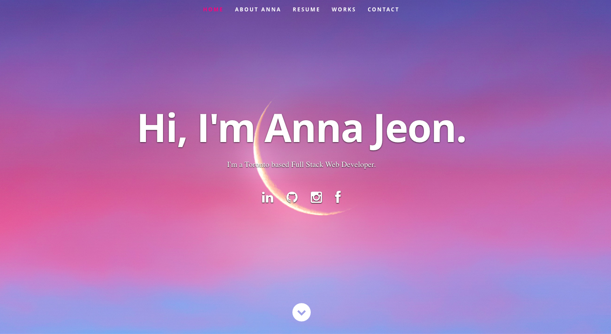
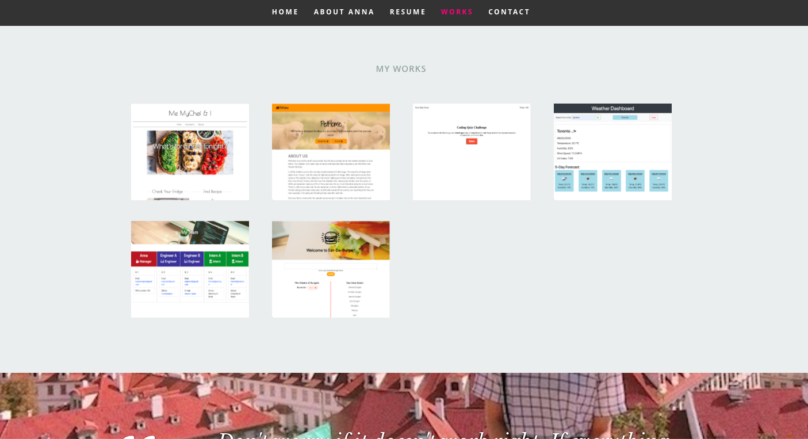

# React Portfolio

Now that you've worked with React and have multiple projects to share, you'll be updating your portfolio and other materials to build toward being employer competitive. Creating a portfolio using React will help set you apart from other developers whose portfolios do not use some of the latest technologies.

If you are opting out of career services, this is *still a required assignment*. Part of being a web developer means being a part of a community. Having a place to share your projects is *necessary* if you're applying for jobs, but is still *critical* on your journey as a developer.

## Demo
### Heroku Application URL
[Click Here to checkout a deployed application](https://secure-refuge-78863.herokuapp.com/)
### Screenshots

## License

- **[MIT License](https://opensource.org/licenses/MIT)** 
- 2020 Anna Jeon

## Questions
| Ask me Now! |
| :---: |
|  |
| <a href="https://github.com/nuleeannajeon" target="_blank">Checkout Github Profile</a> |